# 1、特性描述
​	在智能运维中，异常的发现依赖于庞大的数据流，这其中不光包含了传统kpi数据、系统日志数据，也包含了系统变更的文件内容、进程/线程信息等数据。由于不同数据往往使用不同插件进行采集，客户端的插件管理、资源管理与命令管理成为了一个重点。在此背景下，aops客户端，即agent随之诞生。

​	插件管理方面，agent目前支持一个采集插件的安装：gala-gopher，用于kpi和进程/线程信息的采集。当收到安装命令后，agent会在客户端下载相应软件包并启动插件服务；与此相对，收到卸载插件命令后，agent会将对应插件停止并卸载。在agent运行过程中，用户可以基于自定义的工作流，指定插件的启动与停止，而对于插件采集项开闭状态的获取以及修改，agent会解析相应的配置文件并返回结果。后续会考虑增加fluentd插件，用于系统日志的获取。

​	资源管理方面，agent包含对agent自身的管理以及插件的管理。由于部署在客户端，所以各服务的资源占用控制格外重要。agent会对插件以及aops-agent自身的资源占用进行限制，也可实时获取各服务的资源占用。

​	命令管理方面，agent通过restful接口支持服务端的远程命令下发。除了上述插件管理及资源管理方面的指令外，agent还负责系统文件的采集用于比对文件差异，以及系统基础信息的获取，用于后续识别该主机的运行场景等。所有命令的执行权限会在agent部署时指定，对没有赋予权限的命令，后续将不予执行。值得一提的是，用户部署agent后，会新建用户并赋予root组权限，后续操作都由该用户完成。

​	最后，出于安全角度考虑，agent采用主动注册的方式向服务端注册，省掉了服务端存储主机账号密码的风险。

## 1.1、依赖组件
| 组件   | 组件描述       | 可获得性   |
| :----- | :------------- | :--------- |
| cgroup | 进程级资源管理 | 已社区支持 |
|        |                |            |

## 1.2、License

# 2、需求场景分析

## 2.1、上下文/USE-CASE视图

### 2.1.1、agent注册Use Case

通过注册，管理员可以在服务端发现agent并下发指令。

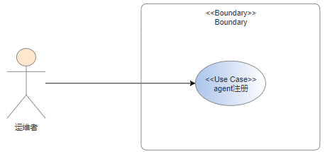

### 2.1.2、插件管理Use Case

用户可以通过agent对客户端机器的插件进行基础的启动停止的操作，同时也可以监控到已注册的各个插件的状态。在异常检测前指定检测项时，需要根据工作流的需要，对主机支持的采集项做概览以及更改采集项的开启状态。

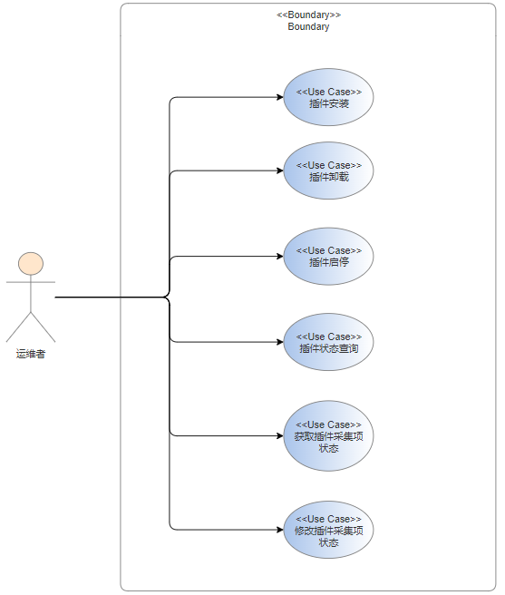

### 2.1.3、资源管理Use Case

agent自身以及插件的资源占用往往需要在严格的控制下。agent提供了对插件以及自身资源占用情况的查询接口，可以查询到占用内存、cpu使用率等信息，同时也支持部分插件的资源限制与修改限制。**对使用资源超出限制的服务，agent会进行停止服务的操作**。

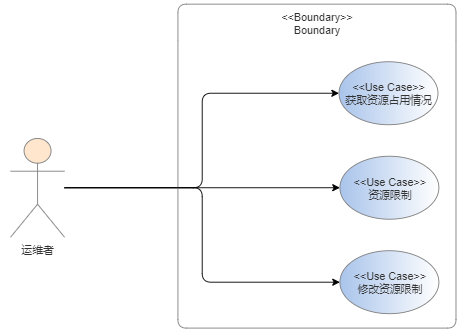

### 2.1.4、命令管理Use Case

当用户在异常检测前，需要对检测主机做场景识别，此时会调用获取主机基础信息的接口，通过机器的运行业务等信息判断主机的场景。当用户通过aops-ragdoll配置溯源服务监控系统重要文件时，会调用agent的获取系统文件接口，将当前的文件传输到服务端进行比对。用户可以在前端查询到agent支持的命令，agent部署时会将支持的命令记录在一个文件中，没打开权限的命令则不予执行。

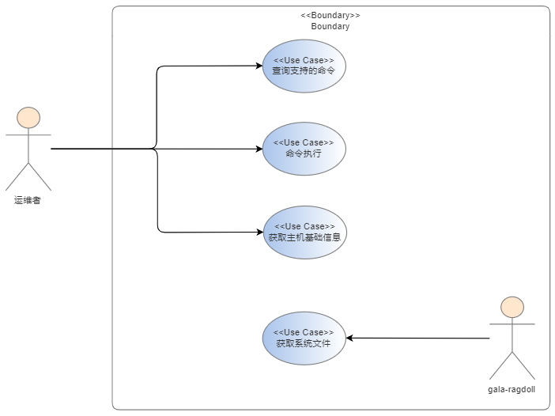

## 2.2、Story分解

| Use  Case   | Story            | 模块     |
|-------- | ---------------- | -------- |
| agent注册 | 支持注册至服务端 | 命令管理模块 |
| 服务管理 | 支持服务的注册和卸载 | 服务管理模块 |
|             | 支持服务的启停 | 服务管理模块 |
|             | 支持agent及各服务的状态查询 | 服务管理模块 |
| | 支持服务采集项的开启情况查询 | 服务管理模块 |
| | 支持服务采集项的开启和关闭 | 服务管理模块 |
| 资源管理 | 支持服务及agent资源监控 | 资源管理模块 |
|  | 支持服务及agent资源限制 | 资源管理模块 |
|  | 支持服务及agent资源限制的修改 | 资源管理模块 |
| 命令管理 | 支持查询支持的命令 | 命令管理模块 |
|  | 支持命令解析 | 命令管理模块 |
|  | 支持命令执行 | 命令管理模块 |
|  | 支持获取系统文件 | 命令管理模块 |
|  | 支持获取主机基础信息 | 命令管理模块 |

# 3、模块设计

agent服务分为三个模块：插件管理模块，资源管理模块以及命令管理模块。插件管理模块主要负责采集插件相关的命令执行，包括安装卸载、启动停止、状态监控，以及对插件配置进行解析并对采集项的状态做查询和修改；资源管理模块主要负责对服务以及agent自身资源限制的管控；命令管理模块负责agent的注册，所有命令的解析和权限控制，以及agent自身支持命令的执行，如获取系统文件以及获取主机基础信息等。三个模块间通过api调用进行交互，交互关系如下图所示：

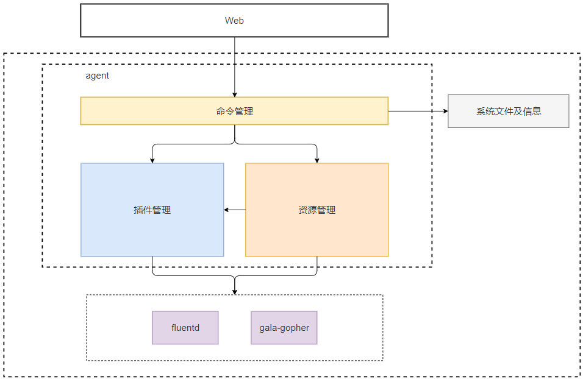

## 3.1、插件管理

### 3.1.1、功能实现

- 插件生命周期管理

  - 插件的安装与卸载

    agent支持的插件通过配置文件来指定。当插件安装时，首先验证插件是否支持，其次验证插件的指定版本的软件包是否已经下载，若未下载则通过yum命令进行下载安装，并将已注册的插件持久化记录在agent中。安装后，若下发安装命令时指定了插件的配置文件，则进行插件配置的更新，最后启动插件。

    卸载插件时，将插件服务暂停并卸载相应软件包，最后删除相应插件注册的持久化记录。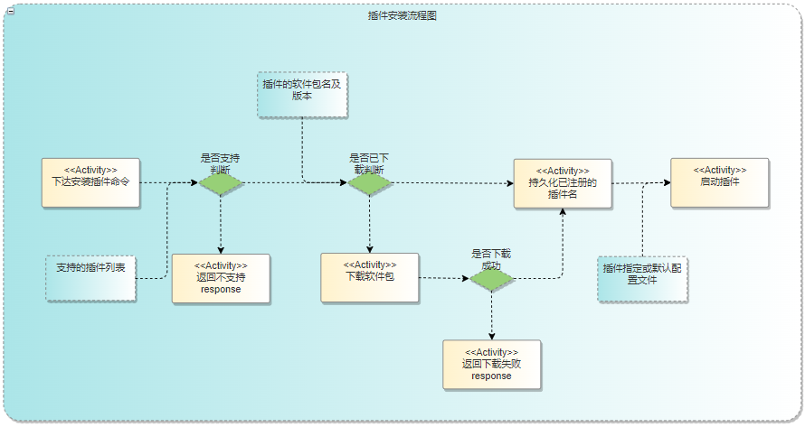

  - 插件的启动与停止

    插件服务的启动与停止均采用systemd来管控。在插件启动后，需要获取插件的进程号，方便后续查询资源占用。

- 插件配置的解析和修改

  目前agent需要通过解析插件的配置文件实现两个命令：获取插件采集项的开闭状态、修改插件采集项的开闭状态。各插件的解析方法固化在代码中， 命令下达并校验通过后，通过python subprocess 库安全调用相关的shell命令。对gala-gopher采集插件来讲，目前只支持对探针的开闭，探针开启后内部采集的数据项也全部开启。

### 3.1.2、UML图

​	设计中支持的两个采集插件 gala-gopher 和 fluentd 继承自插件类基类 PlugIn，为单例模式。

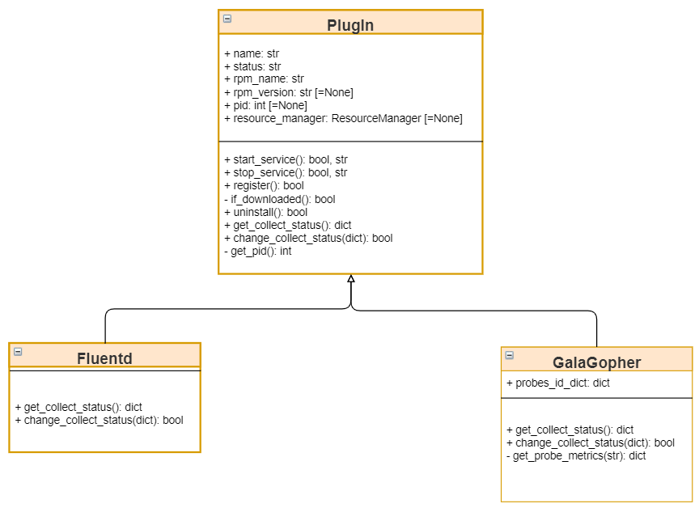

### 3.1.3、Story分解

| Use Case | Story                        |
| -------- | ---------------------------- |
| 插件管理 | 支持插件的安装和卸载         |
|          | 支持安装的启停               |
|          | 支持agent及各插件的状态查询  |
|          | 支持插件采集项的开启情况查询 |
|          | 支持插件采集项的开启和关闭   |

## 3.2、资源管理

### 3.2.1、功能实现

- 资源监控

  在收到获取当前资源占用情况的请求后，首先查询相应插件类对象的进程id，进而使用top命令查询cpu使用率及内存占用情况。

- 资源限制

  对支持资源限制的服务，使用cgroup限制agent及插件进程的资源占用。agent部署后，挂载cpu，memory两个子系统，安装插件并注册成功后，在两个子系统中创建进程文件，并将进程号添加进tasks文件进行监控，在对应文件内添加参数进行限制。超过资源占用上限则服务会被停止。各服务默认占用资源上限如下：

  - agent:
    - cpu 利用率： 0.2%
    - 内存：20M
  - fluentd：
    - cpu利用率：1%
    - 内存：50M

  **由于gala-gopher内部实现了对探针资源的限制，所以目前agent不对gala-gopher做资源限制**。

### 3.2.2、UML图

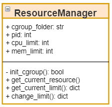

### 3.2.3、Story分解

| Use Case | Story                         |
| -------- | ----------------------------- |
| 资源管理 | 支持插件及agent资源监控       |
|          | 支持插件及agent资源限制       |
|          | 支持插件及agent资源限制的修改 |
|          | 支持插件采集项的开启情况查询  |

## 3.3、命令管理

### 3.3.1、功能实现

- agent注册

  目前提供了ansible脚本可供用户批量注册，也可手动逐台注册。注册时，由客户端向manager(aops-zeus) 发出请求，除了注册的主机名、主机组等信息外，还需传递该用户前端登陆所需的用户名和密码用于权限校验。manager校验通过后，将该用户的主机token传递给agent并持久化。后续agent响应manager的请求时则会根据此token进行身份校验。

  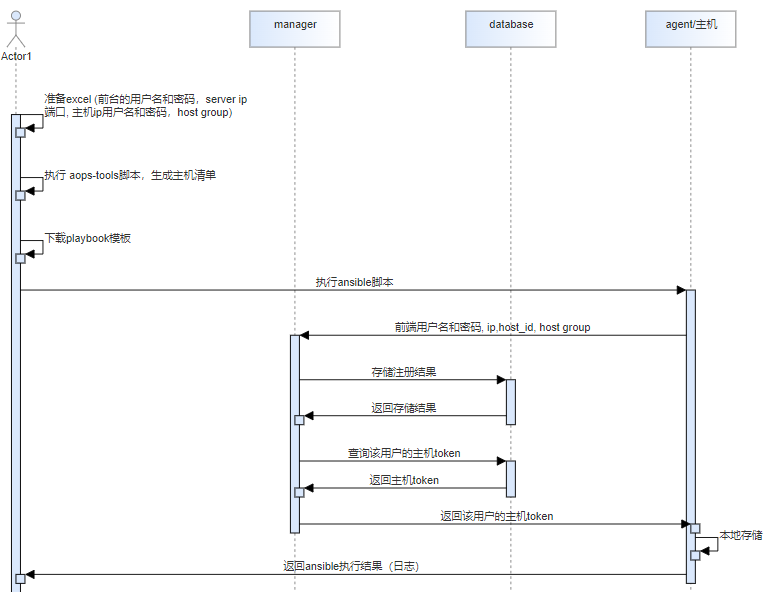

  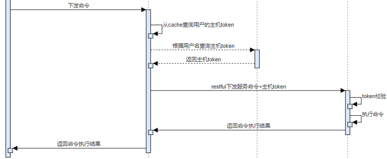

- 命令解析

  通过flask实现restful接口，识别请求并执行或下发至对应模块。

- 命令权限管理

  将支持的接口记录在文件中，并在agent初始化时维护在内存里，只有有权限的接口被调用后才可以执行。

- 获取系统文件

  校验文件是否存在，若存在则通过restful 将文件传输至请求方。文件数大于1时通过压缩包的形式进行传输。

- 主机信息采集

  内置固定的主机信息采集项，每个采集项对应相应的采集方法。执行具体系统命令时采用python 的subprocess 库函数安全执行，获取结果并解析。

### 3.3.2、UML图

agent系统的restful接口继承自aops-util的BaseResponse类，每个restful接口类包含handle函数负责内在逻辑的执行。CommandManager为命令管理类，为单例模式，实例化后维护系统目前支持的接口列表。每个接口的handle函数执行前要调用CommandManager的对象判断是否有权限执行。

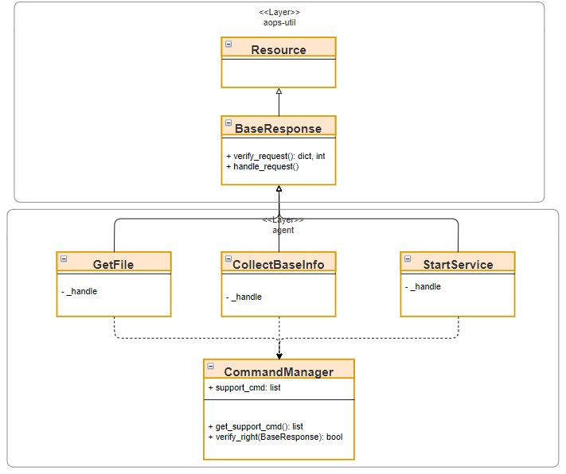

### 3.3.3、Story分解

| Use Case | Story                |
| -------- | -------------------- |
| 命令管理 | agent注册            |
|          | 支持查询支持的命令   |
|          | 支持命令解析         |
|          | 支持命令执行         |
|          | 支持获取系统文件     |
|          | 支持获取主机基础信息 |

# 4、质量属性设计
## 4.1、性能规格
| 规格名称 | 规格指标 |
| :------- | :------- |
| 内存占用 |          |
| 启动时间 |          |
| 响应时间 |          |
| xxx      |          |

## 4.2、可靠性设计

使用systemd进行服务管理，设置service文件自动重启以及开机自启动，可以保障agent实时在线。

## 4.3、安全性设计

#### 1. 账号安全问题

客户端的账号密码不会保存在服务端，而是通过agent进行主动注册，注册后通过服务端下发的主机token进行后续的命令权限校验，可以避免密码泄露的情况。

#### 2. 用户权限问题

由于agent需采集一些系统关键数据以及文件，agent安装后会默认生成aops用户，并赋予root用户组权限。所有命令的执行均通过aops用户完成，可以做到命令区分和溯源。

#### 3. restful接口安全

发送请求时使用token进行身份验证，使用https服务确保请求参数被加密，后端接收请求后对接口参数做每个参数类型的校验。

#### 4. 命令注入问题

agent的命令行操作使用python的subprocess库的popen函数进行执行，且函数的shell参数设置为False，可以有效防止命令注入。

## 4.4、兼容性设计

1. 服务对外接口使用restful接口，对外接口只能增量变化，新版本保证旧版本接口可用。
2. 对于支持的采集服务，指定版本范围（采用>某版本的形式，默认服务接口前向兼容），保证接口可用。

## 4.5、可服务性设计

待考虑

## 4.6、可测试性设计

restful接口可通过mock形式编写自动化测试用例；服务可靠性等方面可通过手动杀死agent进程来验证是否可以自动重启。

# 5、修改日志
| 版本 | 发布说明 |
| :--- | :------- |
|      |          |
|      |          |

# 6、参考目录
