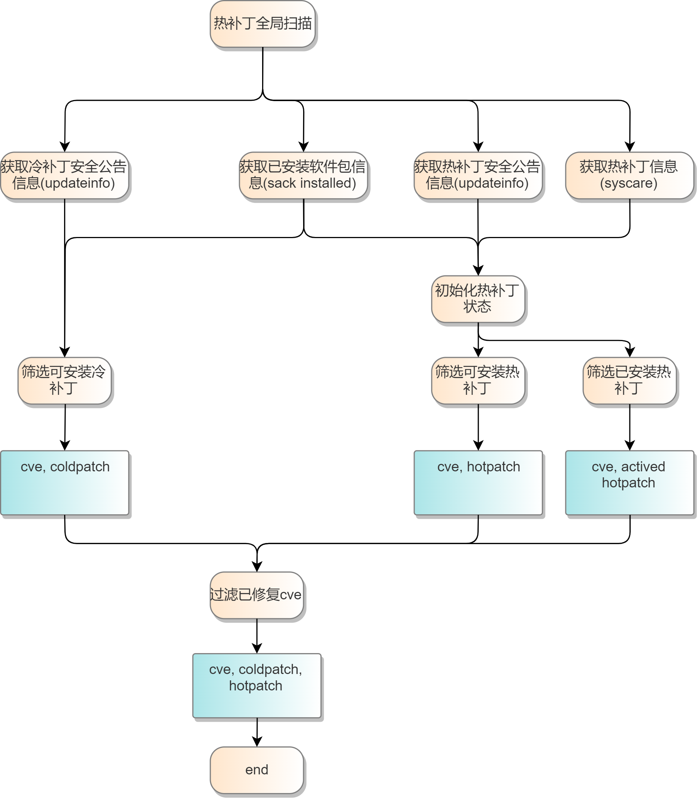
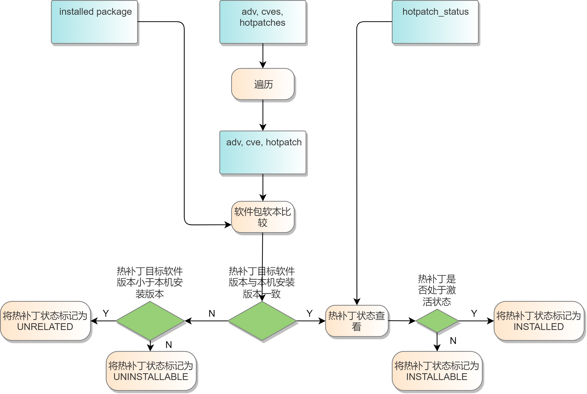
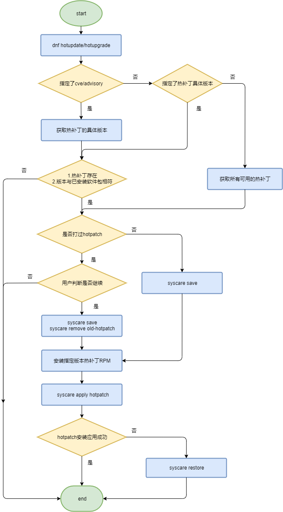
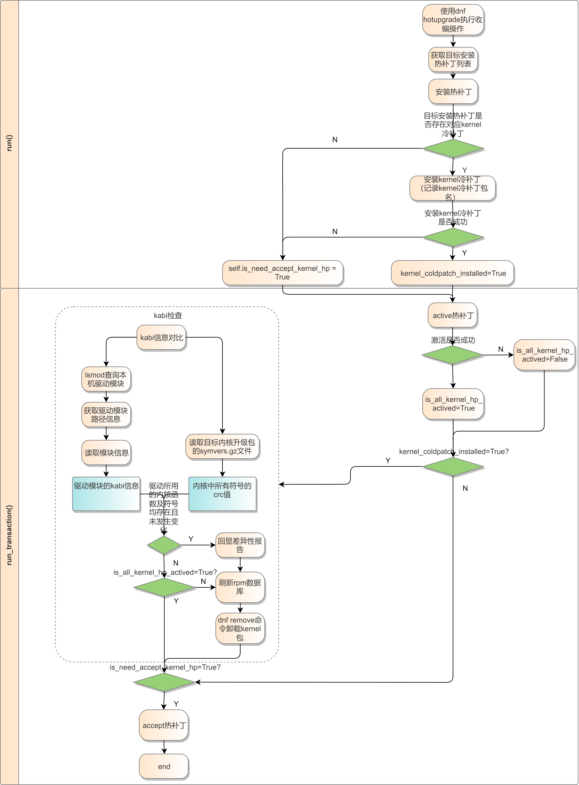
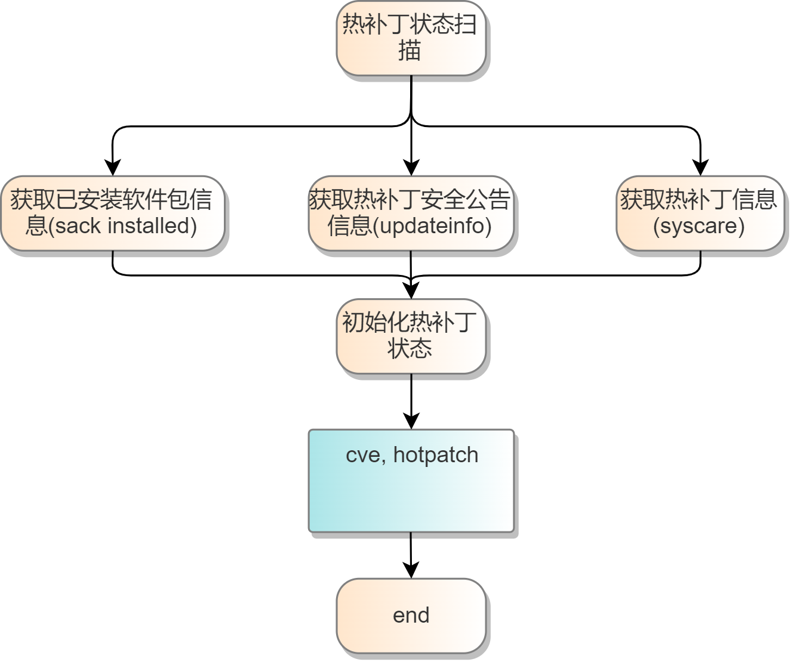
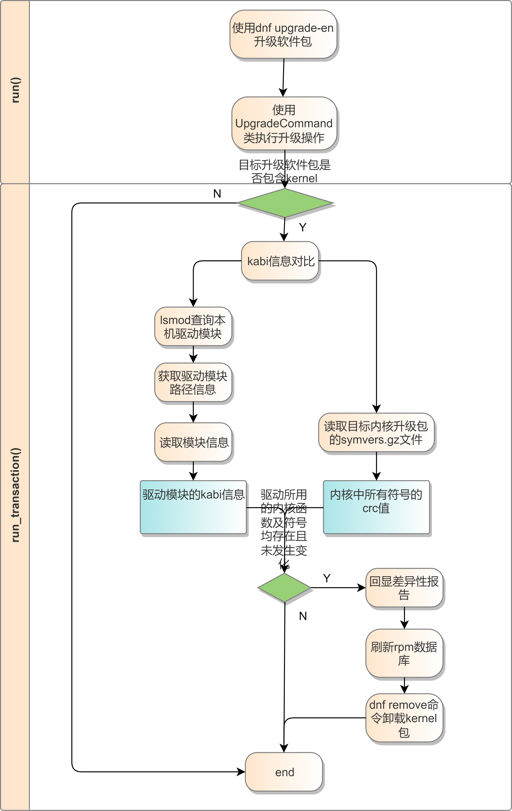

# 1、特性描述
当前单机漏洞扫描存在以下问题：

1. 冷补丁升级需要中断服务
2. 热补丁工具，需要用户自己制作，使用复杂

针对以上问题，dnf热补丁插件的使用目标：

1. 获取社区热补丁发布件
2. 本地进行冷/热补丁漏洞巡检、修复和服务管理
3. 达到程序不中断情况下实现补丁修复的效果

# 2、dnf热补丁插件设计
## 2.1、热补丁工具
基于syscare运行热补丁。syscare项目地址：<https://gitee.com/openeuler/syscare>

## 2.2、热补丁状态图

热补丁的rpm包安装后，可以通过dnf hotpatch --list 查看热补丁的状态。

NOT-APPLIED: 热补丁尚未应用

DEACTIVED: 热补丁已被安装

ACTIVED: 热补丁已被激活

ACCEPTED: 热补丁已被接受，后续重启后会被自动应用激活


## 2.3、热补丁类型

热补丁包括ACC/SGL（accumulate/single）类型

- ACC：增量补丁。目标高版本热补丁包含低版本热补丁所修复问题。
- SGL_xxx：单独补丁，xxx为issue id，如果有多个issue id，用多个'_'拼接。目标修复issue id相关问题。


## 2.4、热补丁命名

```
patch-[软件名称]-[软件版本]-[热补丁名称]-[version]-[release].[架构].rpm

# example 1
patch-kernel-5.10.0-60.66.0.91.oe2203-ACC-1-1.x86_64.rpm
# example 2
patch-kernel-5.10.0-60.66.0.91.oe2203-SGL_CVE_2023_30594-1-1.x86_64.rpm
```

## 2.5、热补丁扫描

### 2.5.1、全局扫描流程图



### 2.5.2、热补丁状态初始化



### 2.5.3、伪代码

```shell
input:
    installed_packages
    updateinfo
    syscareinfo

for package, hotpatch in $syscareinfo:
	save {$package, $hotpatch} to $hotpatchinfo

result = []
for package in $installed_packages:
	# filter cves which $cve.coldpatch_version is higher than $package.version
	extract cve_list from $updateinfo and $pacakge
	for cve in $cve_list:
		tmp = -
		for hotpatch in $cve.hotpatches:
			if $hotpatch.package_version == $pacakge.version:
				$tmp = $hotpatch
				break
		# already hot fixed, ignore it
		if $tmp in $hotpatchinfo:
			continue
		append {$cve, $tmp} to $result

output $result
```

### 2.5.4、CASE

**`pre condition`**

```
CVE-1:
    hotpatch:
        A-hotpatch-1.0-ACC-1-1
    coldpatch:
        A-1.1
CVE-2: 
    hotpatch:
        A-hotpatch-1.1-ACC-1-1
        A-hotpatch-1.0-ACC-1-2
    coldpatch:
        A-1.2
CVE-3:
    hotpatch:
        A-hotpatch-1.1-ACC-1-2
    coldpatch:
        A-1.3
```

**`CASE 1`**

```
installed package: A-1.0
actived hotpatch:

# dnf hot-updateinfo list cves
# 扫描得到3个cve
CVE-1  xxx  A-hotpatch-1.0-ACC-1-1
CVE-2  xxx  A-hotpatch-1.0-ACC-1-2
CVE-3  XXX  -
```

**`CASE 2`**

```
installed package: A-1.0
actived hotpatch: A-hotpatch-1.0-ACC-1-1

# dnf hot-updateinfo list cves
//hufeng:热补丁巡检，命令字list是否合适，待讨论
# 扫描得到2个cve，CVE-1因为已被热修复故不做展示
CVE-2  xxx  A-hotpatch-1.0-ACC-1-2
CVE-3  xxx  -
```

**`CASE 3`**

```
installed package: A-1.0
actived hotpatch: A-hotpatch-1.0-ACC-1-2

# dnf hot-updateinfo list cves
# 扫描得到1个cve
CVE-3  xxx  -
```

**`CASE 4`**

```
installed package: A-1.1
actived hotpatch: 

# dnf hot-updateinfo list cves
# 扫描得到2个cve
CVE-2  xxx  A-hotpatch-1.1-ACC-1-1
CVE-3  xxx  A-hotpatch-1.1-ACC-1-2
```

**`CASE 5`**

```
installed package: A-1.1
actived hotpatch: A-hotpatch-1.1-ACC-1-1

# dnf hot-updateinfo list cves
# 扫描得到1个cve
CVE-3  xxx  A-hotpatch-1.1-ACC-1-2
```

## 2.6、热补丁修复

热补丁主要支持以下三种修复方案：

- 本地热补丁支持按照cve id修复
- 本地热补丁支持热补丁名称修复
- 本地热补丁支持全量修复，参考dnf update/upgrade

流程图如下：




## 2.7、冷补丁收编

- 热补丁升级时，可选择冷补丁收编；
- 无法收编时，自动accept热补丁；
- 如果冷补丁接口变化提供交互确认；




## 2.8、热补丁状态管理

实现思路为dnf插件封装syscare 相关命令，并通过对热补丁updateinfo.xml的解析，将cve信息与热补丁进行关联展示。

- 热补丁状态查询




具体命令参考：[热补丁状态管理](#5.2.3、热补丁状态管理)

## 2.9、内核升级前kabi检查

- 升级软件包
- 升级内核时，检查系统内的驱动对kabi的诉求；如有kabi变化生成接口差异报告；
- 支持强制升级；




# 3、热补丁接口清单

## 3.1、热补丁扫描

```shell
dnf hot-updateinfo list cves [--available(default) | --installed] [--cve [cve_id]] 

General DNF options:
  -h, --help, --help-cmd
                        show command help
  --cve CVES, --cves CVES
                        Include packages needed to fix the given CVE, in updates
Hot-updateinfo command-specific options:                     
  --available          
                        cves about newer versions of installed packages
                        (default)
  --installed
  									    cves about equal and older versions of installed packages
```

- `list cves`

查询主机所有可修复的cve和对应的冷/热补丁

```shell
[root@localhost ~]# dnf hot-updateinfo list cves
# cve-id   level    cold-patch   hot-patch
CVE-2022-30594  Important/Sec. kernel-4.19.90-2206.1.0.0153.oe1.x86_64                        patch-kernel-4.19.90-2112.8.0.0131.oe1-SGL_CVE_2022_30594-1-1.x86_64
CVE-2023-1111   Important/Sec. redis-6.2.5-2.x86_64                                           patch-redis-6.2.5-1-ACC-1-1.x86_64
CVE-2023-1112   Important/Sec. redis-6.2.5-2.x86_64                                           patch-redis-6.2.5-1-ACC-1-1.x86_64
CVE-2023-1111   Important/Sec. redis-6.2.5-2.x86_64                                           patch-redis-6.2.5-1-SGL_CVE_2023_1111_CVE_2023_1112-1-1.x86_64
```

查询主机所有已修复的cve和对应的冷/热补丁

```shell
[root@localhost ~]# dnf hot-updateinfo list cves --installed
# cve-id   level    cold-patch   hot-patch
CVE-2022-36298  Important/Sec. -      patch-kernel-4.19.90-2112.8.0.0131.oe1-SGL_CVE_2022_36298-1-1.x86_64
```

## 3.2、热补丁修复

```shell
dnf hotupgrade [--cve [cve_id]] [PACKAGE ...] [--takeover] [-f]

General DNF options:
  -h, --help, --help-cmd
                        show command help
  --cve CVES, --cves CVES
                        Include packages needed to fix the given CVE, in updates
 
command-specific options:
  --takeover            
  											kernel cold patch takeover operation
  -f
  											force retain kernel rpm package if kernel kabi check fails
  PACKAGE               
  											Package to upgrade
```

- `--cve <cve-id>`

  ```shell
  [root@localhost dnf]# dnf hotupgrade --cve cve-1
  # 指定漏洞编号修复，如果目标cve修复软件包包含ACC类型热补丁，自动关联ACC最高版本热补丁
  ```

- `PACKAGE`

  ```shell
  [root@localhost dnf]# dnf hotupgrade patch-A-1.0.0-1-ACC-1-1.x86_64
  # 直接按照热补丁名称修复。热补丁名称可通过dnf hot-updateinfo list cves 查到
  ```

- 直接执行

  ```shell
  [root@localhost dnf]# dnf hotupgrade
  # 安装并激活所有可安装的热补丁
  ```

- `--takeover`
  ```shell
  [root@localhost dnf]# dnf hotupgrade patch-A-1.0.0-1-ACC-1-1.x86_64 --takeover
  # 直接按照热补丁名称修复，同时对相关内核冷补丁进行收编
  ```

- `--takeover -f`
  ```shell
  [root@localhost dnf]# dnf hotupgrade patch-A-1.0.0-1-ACC-1-1.x86_64 --takeover -f
  # 直接按照热补丁名称修复，同时对相关内核冷补丁进行收编，若冷补丁kabi检查不通过，强制保留该冷补丁
  ```

## 3.3、热补丁状态管理

```shell
dnf hotpatch 

General DNF options:
  -h, --help, --help-cmd
                        show command help
  --cve CVES, --cves CVES
                        Include packages needed to fix the given CVE, in updates

Hotpatch command-specific options:
  --list [{cve, cves}]  show list of hotpatch
  --apply APPLY_NAME apply hotpatch
  --remove REMOVE_NAME remove hotpatch
  --active ACTIVE_NAME action hotpatch
  --deactive DEACTIVE_NAME
                       deactive hotpatch
  --accept ACCEPT_NAME accept hotpatch
```

- `--list`

  ```shell
  [root@localhost dnf]# dnf hotpatch --list
  # 列出已安装的热补丁和状态
  base-pkg/hotpatch           status
  A-1.1-1/ACC/xxx             ACCEPTED
  B-1.1-1/ACC/xxx             DEACTIVED
  C-1.1-1/ACC/xxx             ACTIVED
  D-1.1-1/ACC/xxx             NOT_APPLIED
  
  [root@localhost dnf]# dnf hotpatch --list --cve CVE-1
  # 根据cve id筛选出已安装的热补丁和状态
  base-pkg/hotpatch           status
  A-1.1-1/ACC/xxx             ACCEPTED
  
  [root@localhost dnf]# dnf hotpatch --list cves
  # 列出已安装的热补丁和状态，同时列出其修复的cve。其中一个热补丁可能修复了多个cve
  CVE id   base-pkg/hotpatch        	 status
  CVE-1    A-1.1-1/ACC/xxx             ACCEPTED
  CVE-2    A-1.1-1/ACC/xxx             ACCEPTED
  CVE-3    B-1.1-1/ACC/xxx             DEACTIVED
  CVE-4    B-1.1-1/ACC/xxx             DEACTIVED
  CVE-5    C-1.1-1/ACC/xxx             ACTIVED
  CVE-6    D-1.1-1/ACC/xxx             NOT_APPLIED
  ```

- `--apply`

  ```shell
  [root@localhost dnf]# dnf hotpatch --apply A-1.1-1/ACC
  # NOT_APPLIED状态下，安装并激活热补丁, 状态变为ACTIVED
  ```


- `--active`

  ```shell
  [root@localhost dnf]# dnf hotpatch --active A-1.1-1/ACC
  # DEACTIVED状态下激活热补丁, 状态变为ACTIVED
  ```

- `--deactive`

  ```shell
  [root@localhost dnf]# dnf hotpatch --deactive A-1.1-1/ACC
  # ACTIVED/ACCEPTED状态下去激活热补丁, 状态变为DEACTIVED
  ```

- `--remove`

  这里需注意dnf hotpatch remove 与 dnf remove的区别

  ```shell
  [root@localhost dnf]# dnf hotpatch --remove A-1.1-1/ACC
  # ACTIVED/DEACTIVED/ACCEPTED状态下,移除热补丁, 状态变为NOT_APPLIED
  
  [root@localhost dnf]# dnf remove A-1.1-1/ACC  
  # 直接remove热补丁软件包，remove掉后不会在dnf hotpatch --list中显示。若补丁已被激活，则会自动去激活再remove掉rpm包
  ```

- `--accept`

  ```shell
  [root@localhost dnf]# dnf hotpatch --accept A-1.1-1/ACC
  # ACTIVED状态下接收热补丁。重启后由于syscare服务的设置，ACCEPTED状态的热补丁会自动应用且状态为ACCEPTED，而ACTIVED的热补丁重启后则会变为NOT_APPLIED
  ```

## 3.4、内核升级前kabi检查

```shell
dnf upgrade-en [PACKAGE] [--cve [cve_id]] 

General DNF options:
  -h, --help, --help-cmd
                        show command help
  --cve CVES, --cves CVES
                        Include packages needed to fix the given CVE, in updates
Upgrade-en command-specific options:                     
  PACKAGE
  											Package to upgrade
```

- `PACKAGE`

  ```shell
  [root@openEuler ~]# dnf upgrade-en kernel-1-1.3.x86_64
  # 升级内核包时，自动进行kabi检查
  # 若kabi检查不通过，输出差异性报告；自动卸载对应目标内核软件包；恢复默认内核启动引导项
  Dependencies resolved.
  xxxx(Install messgaes)
  Is this ok [y/N]: y
  Downloading Packages:
  xxxx(Install process)                                                                                       
  Complete!
  Kabi check for kernel-1-1.3.x86_64:
  [Fail] Here are 81 loaded kernel modules in this system, 78 pass, 3 fail.
  Failed modules are as follows:
  No. Module      Difference
  1   nf_nat_ipv6 secure_ipv6_port_ephemeral                : 0xe1a4f16a != 0x0209f3a7
  2   nf_nat_ipv4 secure_ipv4_port_ephemeral                : 0x57f70547 != 0xe3840e18
  3   kvm_intel   kvm_lapic_hv_timer_in_use                 : 0x54981db4 != 0xf58e6f1f
                  kvm_apic_write_nodecode                   : 0x56c989a1 != 0x24c9db31
                  kvm_complete_insn_gp                      : 0x99c2d256 != 0xcd8014bd
  Gonna remove kernel-1-1.3.x86_64 due to kabi check failed.
  Rebuild rpm database succeed.
  Remove package succeed: kernel-1-1.3.x86_64.
  Restore the default boot kernel succeed: kernel-1-1.2.x86_64.
  ```

```shell
[root@openEuler ~]# dnf upgrade-en kernel-1-1.3.x86_64
Dependencies resolved.
xxxx(Install messgaes)
Is this ok [y/N]: y
Downloading Packages:
xxxx(Install process)  
Complete!
Kabi check for kernel-1-1.3.x86_64:
[Success] Here are 81 loaded kernel modules in this system, 81 pass, 0 fail.
```

- 全量修复

全量修复如果包含目标kernel的升级，输出根据不同的kabi检查情况与`dnf upgrade-en PACKAGE`命令相同。


# 4、修改日志

| 版本  | 发布说明                                                     | 修改人        | 修改时间   |
| :---- | :----------------------------------------------------------- | ------------- | ---------- |
| 1.1.0 | 1.新增热补丁插件相关视图<br />2.更新热补丁接口清单| 胡峰/罗盛炜   | 2023/2/20  |
| 1.1.1 | 1.热补丁状态补充accept状态，用于管理重启生效| 胡峰          | 2023/5/11  |
| 1.1.2 | 1.新增热补丁插件部分命令描述和设计 | 朱云成        | 2023/5/18  |
| 1.1.3 | 1.修改dnf巡检、状态查询命令部分描述和设计                      | 王光格        | 2023/6/16  |
| 2.1.0 | 1.修改dnf巡检、状态查询命令部分描述和设计<br />2.新增dnf热补丁收编、内核升级前kabi检查设计和接口| 王光格        | 2024/1/5  |

